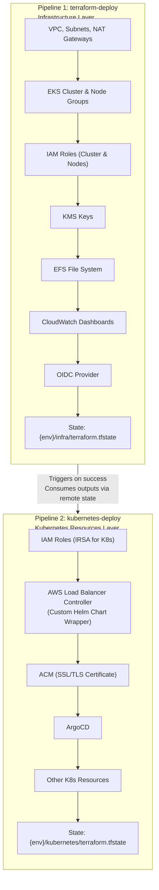
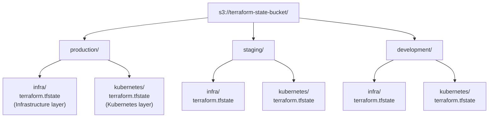

# 🏗️ Architecture Overview <!-- omit in toc -->

This document describes the architecture and design decisions for the Cloud Solutions Inc. infrastructure.

## 📑 Table of Contents <!-- omit in toc -->

- [🏛️ Two-Pipeline Architecture](#️-two-pipeline-architecture)
- [🧩 Infrastructure Components](#-infrastructure-components)
- [💡 Key Design Decisions](#-key-design-decisions)

## 🏛️ Two-Pipeline Architecture

### Design Overview

This infrastructure implements a **two-pipeline, two-state architecture** that separates infrastructure provisioning from Kubernetes resource management:

### Deployment Flow

1. **Infrastructure Pipeline** (`terraform-deploy`):
   - Deploys AWS infrastructure (VPC, EKS, IAM, KMS, etc.)
   - Outputs cluster information (endpoint, OIDC provider, etc.)
   - Stores state in `{env}/infra/terraform.tfstate`

2. **Kubernetes Pipeline** (`kubernetes-deploy`):
   - Triggered automatically after infrastructure deployment succeeds
   - Reads infrastructure outputs via `terraform_remote_state`
   - Deploys SSL/TLS certificates in ACM
   - Deploys Kubernetes resources (ArgoCD, Load Balancer Controller)
   - Stores state in `{env}/kubernetes/terraform.tfstate`

### State Management

States are completely separated by layer:

**Benefits of This Architecture:**

- ✅ **Separation of Concerns**: Infrastructure vs Applications
- ✅ **Independent Deployments**: Update ArgoCD without touching EKS
- ✅ **Granular Rollback**: Revert only the layer that failed
- ✅ **Reduced Blast Radius**: Changes are isolated to their layer
- ✅ **Follows Best Practices**: No providers inside modules
- ✅ **Cleaner Dependencies**: Remote state for cross-layer references
- ✅ **Better CI/CD**: Two focused pipelines instead of one monolithic

## 🧩 Infrastructure Components

This infrastructure implements a highly available, multi-AZ architecture on AWS with the following components:

### Compute Resources

- **Amazon EKS Cluster**: Managed Kubernetes control plane for orchestrating containerized applications
- **EKS Node Group**: Auto-scaling worker nodes running on EC2 instances
- **Auto Scaling**: Dynamic node scaling based on workload demands
- **Kubernetes Version**: Configurable, currently set to latest stable version

#### Kubernetes Add-ons

- **VPC CNI**: Native VPC networking for Kubernetes pods
- **CoreDNS**: Cluster DNS service
- **kube-proxy**: Network proxy for Kubernetes services
- **EBS CSI Driver**: Persistent volume support using Amazon EBS with IRSA
- **EFS CSI Driver**: Shared file system support using Amazon EFS with IRSA

### Network Layer

- **VPC**: Isolated network environment with custom CIDR block
- **Multi-AZ Design**: Resources distributed across 3 availability zones for high availability
- **Public Subnets**: Host NAT gateways and Load Balancers
- **Private Subnets**: Host EKS worker nodes for enhanced security
- **NAT Gateways**: Enable outbound internet access for private resources
- **VPC Flow Logs**: Network traffic monitoring for security and troubleshooting

### Storage

- **EFS File System**: Shared persistent storage for containers
  - Encrypted at rest
  - Lifecycle management to Infrequent Access storage
  - Mount targets in each availability zone
  - EFS CSI Driver with IRSA integration
- **EBS Volumes**: Persistent block storage via EBS CSI Driver
  - Encrypted with dedicated KMS key
  - Uses gp3 volumes for better performance

### Monitoring and Logging

- **CloudWatch Logs**: Centralized logging for EKS control plane and applications
- **CloudWatch Dashboard**: Real-time visualization of cluster metrics
- **SNS Notifications**: Email alerts for critical issues (optional)
- **Control Plane Logging**: API, audit, authenticator, controller manager, and scheduler logs

### GitOps and Application Delivery

#### AWS Load Balancer Controller
- **Custom Helm Chart**: Professional wrapper chart pattern
  - ServiceAccount managed via Helm template
  - Official AWS chart as dependency
  - IAM Role (IRSA) managed by Terraform
- **High Availability**: 2 replicas with anti-affinity rules
- **Automatic Management**: ALBs and NLBs for Ingress and Services

#### ArgoCD
- **Declarative GitOps**: Continuous delivery tool for Kubernetes
  - Deployed via shared Terraform module
  - Automatic application sync from Git repositories
  - Exposed via AWS Application Load Balancer (optional)
  - Health assessment and automated rollbacks
  - Support for Helm charts, Kustomize, and plain YAML manifests

### Security Features

#### Network Security
- **Security Groups**: Fine-grained network access control
  - EKS control plane isolated with managed security group
  - Worker nodes in private subnets
  - EFS only accessible from worker nodes
  - ALB security groups restrict traffic to HTTP/HTTPS
- **Private Subnets**: Worker nodes isolated from direct internet access
- **VPC Flow Logs**: Network traffic monitoring for security auditing

#### Identity and Access Management
- **IAM Roles**: Least-privilege access with IRSA (IAM Roles for Service Accounts)
  - OIDC provider configured for pod-level IAM roles
  - Separate roles for infrastructure and Kubernetes layers
  - Pre-configured roles for EBS CSI Driver and EFS CSI Driver
  - Load Balancer Controller role with minimal required permissions
  - Separate IAM roles for cluster and node groups
- **IMDSv2**: Enforced on all EC2 instances for enhanced metadata security

#### Encryption at Rest
All data is encrypted at rest using industry-standard encryption:
- **Kubernetes Secrets**: Encrypted using AWS KMS with automatic key rotation
  - Custom KMS key: `${project_name}-${environment}-eks-key`
  - 10-day deletion window for key recovery
- **EBS Volumes**: All node volumes encrypted with dedicated KMS key
  - Custom KMS key: `${project_name}-${environment}-ebs-key`
  - Uses gp3 volumes for better performance
  - Automatic key rotation enabled
- **EFS File System**: Encrypted at rest using AWS-managed encryption
  - Automatic encryption of all data and metadata

#### Encryption in Transit
- **EKS API Server**: All communications use TLS 1.2+
- **Node-to-Control Plane**: Encrypted communication via AWS PrivateLink
- **Application Traffic**: HTTPS/TLS supported via AWS Load Balancer Controller
- **EFS Mount**: Data encrypted in transit using TLS

## 💡 Key Design Decisions

1. **Two-Pipeline Architecture**: Separation of infrastructure and Kubernetes resources for better maintainability
2. **Separate Terraform States**: Independent state files for each layer reduce blast radius
3. **Remote State Data Sources**: Clean cross-layer dependencies without tight coupling
4. **EKS over Self-Managed Kubernetes**: AWS-managed control plane eliminates operational overhead
5. **Multi-AZ**: High availability across 3 availability zones
6. **Private Node Groups**: Enhanced security by isolating worker nodes
7. **Managed Node Groups**: Simplified node lifecycle management and updates
8. **IRSA Support**: Pod-level IAM roles for fine-grained permissions
9.  **EKS Add-ons**: Managed versions of critical Kubernetes components
10. **End-to-End Encryption**: KMS encryption for secrets and EBS, encryption in transit for all communications
11. **IMDSv2 Enforcement**: Enhanced EC2 metadata security on all nodes
12. **GitOps with ArgoCD**: Declarative application delivery using Git as source of truth
13. **Custom Helm Charts**: Professional wrapper pattern for better maintainability
15. **Modular Design**: Reusable modules for different environments
16. **Infrastructure as Code**: Version-controlled, repeatable deployments

---

**Built with ❤️ for Cloud Solutions Inc.**
