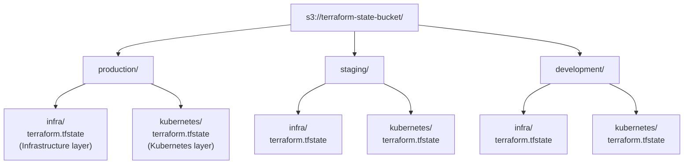

# 🚀 Terraform Remote State Bootstrap Instructions <!-- omit in toc -->

This document provides instructions for bootstrapping a Terraform remote state backend using an S3 bucket. The provided script automates the creation of the necessary S3 bucket with appropriate configurations.

## 📑 Table of Contents <!-- omit in toc -->

- [📋 Prerequisites](#-prerequisites)
- [📚 Usage](#-usage)
- [🏗️ What the Script Creates](#️-what-the-script-creates)
- [📁 State File Structure](#-state-file-structure)
- [📝 Example Backend Configurations](#-example-backend-configurations)
- [🔧 Troubleshooting](#-troubleshooting)

## 📋 Prerequisites

- AWS CLI installed and configured
- AWS credentials with permissions to create S3 buckets
- Appropriate IAM permissions:
  - `s3:CreateBucket`
  - `s3:PutBucketVersioning`
  - `s3:PutEncryptionConfiguration`
  - `s3:PutPublicAccessBlock`

## 📚 Usage

### Default Configuration

Run the script with default settings (bucket name will include your AWS account ID):

```bash
./scripts/bootstrap-terraform-backend.sh
```

### Custom Configuration

Override defaults using environment variables:

```bash
export TF_STATE_BUCKET="my-custom-terraform-state-bucket"
export TF_ENVIRONMENT="staging"
export AWS_REGION="eu-west-1"
./scripts/bootstrap-terraform-backend.sh
```

## 🏗️ What the Script Creates

**S3 Bucket** for storing Terraform state files with:
  - Versioning enabled (for state history)
  - Server-side encryption (AES256)
  - Public access blocked
  - Region-specific configuration (if applicable)

## 📁 State File Structure

This project uses a **two-layer architecture** with separate state files:



**Why Two Separate States?**

- ✅ **Separation of Concerns**: Infrastructure vs Kubernetes resources
- ✅ **Independent Deployments**: Update ArgoCD without touching EKS
- ✅ **Granular Rollback**: Revert only the layer that failed
- ✅ **Reduced Blast Radius**: Changes are isolated to their layer

## 📝 Example Backend Configurations

### Infrastructure Layer

**File**: `environments/production/tfbackend.hcl`

```hcl
bucket       = "terraform-state-123456789012"
key          = "production/infra/terraform.tfstate"
region       = "us-east-1"
use_lockfile = true
encrypt      = true
```

### Kubernetes Layer

**File**: `kubernetes/environments/production/tfbackend.hcl`

```hcl
bucket       = "terraform-state-123456789012"
key          = "production/kubernetes/terraform.tfstate"
region       = "us-east-1"
use_lockfile = true
encrypt      = true
```

## 🔧 Troubleshooting

### Bucket name already taken
S3 bucket names are globally unique. Use `TF_STATE_BUCKET` to specify a different name.

### Permissions error
Ensure your AWS credentials have the required IAM permissions listed above.

### Region mismatch
Ensure `AWS_REGION` matches your desired region.

### State file not found
Make sure you've:
1. Run the bootstrap script to create the S3 bucket
2. Created the backend configuration files with correct paths
3. Initialized Terraform with the backend config

### Wrong state file being used
Verify the `key` parameter in your `tfbackend.hcl` file:
- Infrastructure: Should end with `/infra/terraform.tfstate`
- Kubernetes: Should end with `/kubernetes/terraform.tfstate`

---

**Built with ❤️ for Cloud Solutions Inc.**
