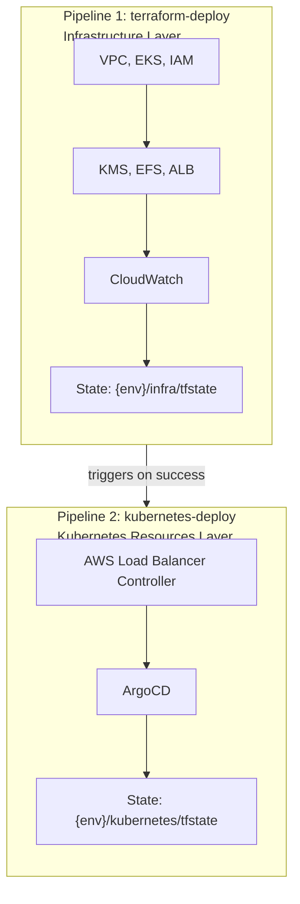
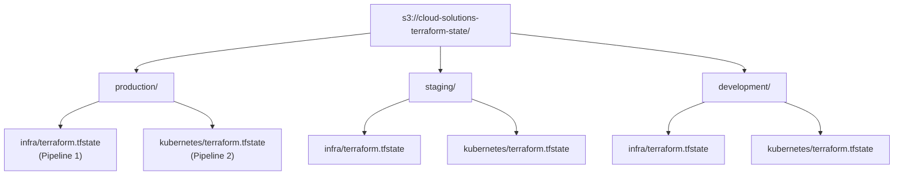

# 🚀 CI/CD Pipeline <!-- omit in toc -->

CI/CD is implemented using GitHub Actions for automated testing and deployment.

The GitHub Actions workflows provide:

1. **Validation**: Format check and terraform validate on all PRs
2. **Planning**: Automatic plan with PR comments showing changes
3. **Deployment**: Automatic apply on merge to main branch
4. **Outputs**: Deployment summary with cluster details

## 📑 Table of Contents <!-- omit in toc -->

- [📐 Pipeline Architecture](#-pipeline-architecture)
- [📄 Workflow Files](#-workflow-files)
- [🌐 Environment-Based Deployments](#-environment-based-deployments)
- [🔐 AWS Authentication Setup](#-aws-authentication-setup)
- [🔑 Required Secrets and Variables](#-required-secrets-and-variables)
- [📊 Monitoring](#-monitoring)

## 📐 Pipeline Architecture

### Two-Stage Deployment

The deployment is split into **two separate pipelines** for better separation of concerns:



**Why Two Pipelines?**

- ✅ **Separation of Concerns**: Infrastructure vs Applications
- ✅ **Independent Deployments**: Update ArgoCD without touching EKS
- ✅ **Granular Rollback**: Revert only the layer that failed
- ✅ **Reduced Risk**: Separate states reduce corruption chances
- ✅ **Best Practices**: Avoids providers inside modules (anti-pattern)

### State Separation



## 📄 Workflow Files

1. **`.github/workflows/terraform-deploy.yml`**: Infrastructure deployment
   - Runs on PRs (plan only) and pushes to main (plan + apply)
   - Posts plan results as PR comments
2. **`.github/workflows/kubernetes-deploy.yml`**: Kubernetes resources deployment
   - Runs on PRs to kubernetes/ directory (plan only)
   - Triggers automatically after successful infrastructure deployment
   - Posts plan results as PR comments

## 🌐 Environment-Based Deployments

The pipeline supports deploying to multiple environments (development, staging, production) using environment-specific configurations from the `environments/` folder.

### 🔒 Deployment Safety

**The pipelines are configured to prevent accidental deployments:**

- ✅ **PRs without labels**: Only run `terraform plan` (no apply)
- ✅ **Push to main**: Automatically deploys to production
- ✅ **Git tags**: Only valid tags (`dev-*`, `stg-*`, `prd-*`) trigger deployments
- ✅ **Manual dispatch**: Explicit environment selection required
- ❌ **Invalid tags**: Workflow fails and blocks deployment
- ❌ **No defaults**: No automatic deployment to development without explicit triggers

### Deployment Triggers

#### 1️⃣ Manual Deployment (via GitHub UI)

Go to **Actions** → **Terraform Deploy** → **Run workflow**

Select the target environment from the dropdown:
- `development`
- `staging`
- `production`

#### 2️⃣ Automatic Deployment via PR Labels

Add one of these labels to your pull request:
- `deploy:development` → Plans for development environment
- `deploy:staging` → Plans for staging environment
- `deploy:production` → Plans for production environment

**⚠️ Important:** PRs **only run `terraform plan`** and never apply changes, regardless of labels. The labels only determine which environment's configuration to use for planning.

**Pipeline Behavior on PRs:**
- **Infrastructure changes** (`.tf` files in root): `terraform-deploy` workflow runs and posts plan as PR comment
- **Kubernetes changes** (`kubernetes/` directory): `kubernetes-deploy` workflow runs and posts plan as PR comment
- Both workflows can run independently on the same PR if changes affect both areas

**Via GitHub UI:**
1. Open your PR
2. Click the gear icon next to "Labels"
3. Create/select the appropriate label

**Via GitHub CLI:**
```bash
gh pr edit <PR-NUMBER> --add-label "deploy:production"
```

**To actually deploy changes:**
- Merge to `main` (deploys to production)
- Use manual workflow dispatch
- Push a deployment tag (dev-*, stg-*, prd-*)

#### 3️⃣ Automatic Deployment via Git Tags

Push tags matching these patterns:
- `dev-*` → Deploys to development
- `stg-*` → Deploys to staging
- `prd-*` → Deploys to production

**Example:**
```bash
git tag prd-v1.0.0
git push origin prd-v1.0.0
```

#### 4️⃣ Push to Main Branch

Pushing to `main` automatically deploys to **production**. This is the primary production deployment method.

**⚠️ Safety Note:** Only push to main when you're ready to deploy to production!

### Environment Configuration

Each environment uses separate configurations for each layer:

#### Infrastructure Layer (root directory)
- **tfvars file**: `environments/{environment}/terraform.tfvars`
- **Backend config file**: `environments/{environment}/tfbackend.hcl`
- **Terraform state**: `{environment}/infra/terraform.tfstate` in S3

Example `environments/production/tfbackend.hcl`:
```hcl
bucket       = "cloud-solutions-terraform-state"
key          = "production/infra/terraform.tfstate"
region       = "eu-west-1"
use_lockfile = true
encrypt      = true
```

#### Kubernetes Layer (kubernetes/ directory)
- **tfvars file**: `kubernetes/environments/{environment}/terraform.tfvars`
- **Backend config file**: `kubernetes/environments/{environment}/tfbackend.hcl`
- **Terraform state**: `{environment}/kubernetes/terraform.tfstate` in S3

Example `kubernetes/environments/production/tfbackend.hcl`:
```hcl
bucket       = "cloud-solutions-terraform-state"
key          = "production/kubernetes/terraform.tfstate"
region       = "eu-west-1"
use_lockfile = true
encrypt      = true
```

The pipeline will automatically use the appropriate backend configuration file during `terraform init`.

## 🔐 AWS Authentication Setup

The pipeline uses OIDC (OpenID Connect) for secure authentication with AWS, eliminating the need for long-lived credentials.

### 🔗 Setting Up OIDC Connection Between GitHub and AWS

#### 1️⃣ Create the OIDC Identity Provider in AWS

```bash
aws iam create-open-id-connect-provider \
  --url https://token.actions.githubusercontent.com \
  --client-id-list sts.amazonaws.com \
  --thumbprint-list 6938fd4d98bab03faadb97b34396831e3780aea1
```

#### 2️⃣ Create IAM Role for GitHub Actions

Create a trust policy file `github-trust-policy.json`:

```json
{
  "Version": "2012-10-17",
  "Statement": [
    {
      "Effect": "Allow",
      "Principal": {
        "Federated": "arn:aws:iam::YOUR_ACCOUNT_ID:oidc-provider/token.actions.githubusercontent.com"
      },
      "Action": "sts:AssumeRoleWithWebIdentity",
      "Condition": {
        "StringEquals": {
          "token.actions.githubusercontent.com:aud": "sts.amazonaws.com"
        },
        "StringLike": {
          "token.actions.githubusercontent.com:sub": "repo:YOUR_ORG/YOUR_REPO:*"
        }
      }
    }
  ]
}
```

Create the IAM role:

```bash
aws iam create-role \
  --role-name GitHubActionsRole \
  --assume-role-policy-document file://github-trust-policy.json
```

#### 3️⃣ Attach Required Permissions

Attach the necessary policies for Terraform operations:

```bash
# For full admin access (development/testing)
aws iam attach-role-policy \
  --role-name GitHubActionsRole \
  --policy-arn arn:aws:iam::aws:policy/AdministratorAccess

# For production, create a custom policy with minimal required permissions
```

The workflow uses the `aws-actions/configure-aws-credentials@v4` action which automatically handles OIDC authentication. When a workflow runs, GitHub generates a short-lived OIDC token that AWS exchanges for temporary credentials.

### ✨ Benefits of OIDC Authentication

- ✅ No long-lived credentials stored in GitHub
- ✅ Automatic credential rotation
- ✅ Fine-grained access control per repository/branch
- ✅ Enhanced security posture
- ✅ Audit trail through AWS CloudTrail

## 🔑 Required Secrets and Variables

Both pipelines (`terraform-deploy.yml` and `kubernetes-deploy.yml`) require the following GitHub secrets and variables to be configured.

### 📋 Repository Variables

Configure these in **Settings → Secrets and variables → Actions → Variables**:

| Variable     | Description                           | Example Value              | Required By    |
| ------------ | ------------------------------------- | -------------------------- | -------------- |
| `TF_VERSION` | Terraform version to use in pipelines | `1.9.8`                    | Both pipelines |
| `AWS_REGION` | AWS region for deployments            | `us-east-1` or `eu-west-1` | Both pipelines |

**To add variables:**
```bash
# Via GitHub CLI
gh variable set TF_VERSION --body "1.9.8"
gh variable set AWS_REGION --body "us-east-1"

# Via GitHub UI
# Settings → Secrets and variables → Actions → Variables → New repository variable
```

### 🔐 Repository Secrets

Configure these in **Settings → Secrets and variables → Actions → Secrets**:

| Secret              | Description                                 | Example Value                                      | Required By           | Optional      |
| ------------------- | ------------------------------------------- | -------------------------------------------------- | --------------------- | ------------- |
| `AWS_ROLE_ARN`      | ARN of the IAM role for OIDC authentication | `arn:aws:iam::123456789012:role/GitHubActionsRole` | Both pipelines        | No            |
| `INFRACOST_API_KEY` | API key for infrastructure cost estimation  | `ico-xxxxxxxxxxxxx`                                | terraform-deploy only | Yes           |
| `GITHUB_TOKEN`      | GitHub authentication token                 | *Auto-provided by GitHub*                          | terraform-deploy only | Auto-provided |

**To add secrets:**
```bash
# Via GitHub CLI
gh secret set AWS_ROLE_ARN --body "arn:aws:iam::123456789012:role/GitHubActionsRole"
gh secret set INFRACOST_API_KEY --body "ico-xxxxxxxxxxxxx"

# Via GitHub UI
# Settings → Secrets and variables → Actions → Secrets → New repository secret
```

### 🧪 Verify Configuration

After configuring secrets and variables, test the setup:

```bash
# Trigger a manual workflow dispatch
gh workflow run terraform-deploy.yml -f environment=development

# Check workflow status
gh run list --workflow=terraform-deploy.yml --limit 1

# View logs if needed
gh run view --log
```

## 📊 Monitoring

### Pipeline Monitoring

Monitor CI/CD pipeline execution and health:

**GitHub Actions Monitoring:**
```bash
# List recent workflow runs
gh run list --limit 10

# View specific run details
gh run view <run-id>

# View run logs
gh run view <run-id> --log

# Watch a running workflow
gh run watch
```

### Deployment Tracking

**Monitor Active Deployments:**
```bash
# Check current deployments
gh run list --workflow=terraform-deploy.yml --status=in_progress
gh run list --workflow=kubernetes-deploy.yml --status=in_progress

# View deployment history
gh run list --workflow=terraform-deploy.yml --limit 20
```

**Terraform State Monitoring:**
```bash
# Check last state modification
aws s3api head-object \
  --bucket cloud-solutions-terraform-state \
  --key production/infra/terraform.tfstate \
  | grep LastModified

# List all state files
aws s3 ls s3://cloud-solutions-terraform-state/ --recursive | grep terraform.tfstate
```

### Alerts and Notifications

**GitHub Actions Notifications:**
- Pipeline failures trigger email notifications to repository watchers
- PR comments automatically notify reviewers of plan results

### Related Monitoring Documentation

- [Architecture Monitoring](ARCHITECTURE.md#monitoring-and-logging) - Infrastructure-wide monitoring
- [Kubernetes Monitoring](KUBERNETES.md#-monitoring) - Kubernetes layer monitoring

---

**Built with ❤️ for Cloud Solutions Inc.**
